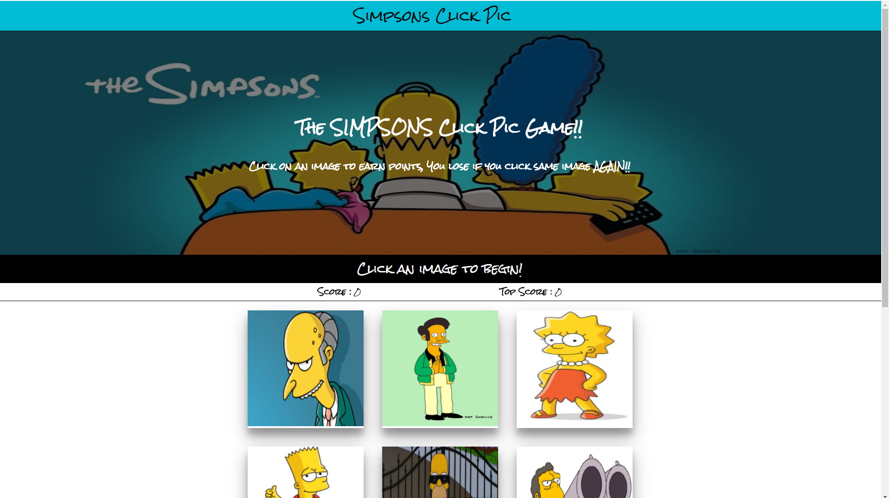

# Simpsons Game 

There are 9 images which will reload in different sequence every time an image is clicked. Goal is to NOT click the same image twice and get consecutively click a different image every time!! 

## Getting Started
Following instructions will get you a copy of the project up and running on your local machine for development and testing purposes.

### Prerequisites
[Node.js](http://www.nodejs.org) | [React.js](http://www.reactjs.org)

### Installing 

- `git clone` the repo 
- `yarn` or `npm install` in root folder, to install all dependencies 
- `yarn start` to open the app on localhost. 

## Built With
+ [React](https://reactjs.org/)
+ [Node.js](https://nodejs.org/en/)
+ [Yarn](https://yarnpkg.com/en/)
+ [Material UI](https://material-ui.com/)
+ [Google Fonts](https://fonts.google.com/)

### Using a function to render html with React
The beauty of React lies in how fast it renders to the DOM and using state to handle client side functionality without the use of jQuery. 

### Future Improvements 

* Add more stages 
* Create a back-end to store user scores
* Create login / registration for game 

### Author 
- Daniel Oh-[danniboi82](http://www.github.com/danniboi82)

